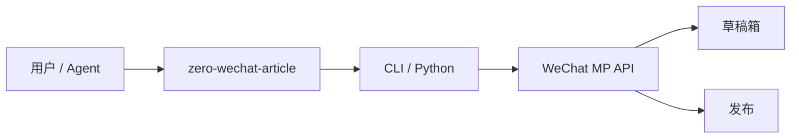

# Architecture

## 目标

用 **公众号官方 API** 实现可审计的图文流水线，不依赖浏览器 RPA。

## 模块

| 模块 | 职责 |
|------|------|
| `config` | 环境变量、发布确认开关 |
| `client` | `access_token`、HTTP 封装 |
| `cli` | 本地验证与后续子命令 |
| （待建）`draft` | 草稿 CRUD |
| （待建）`media` | 素材上传 |
| （待建）`workflow` | 选题 → 生成 → 草稿 |

## 与监督者关系

- 实现仓库：`zero-wechat-article-agent`
- 登记：`zero-supervisor/agents/zero-wechat-article-agent.md`
- 跨云资源（OSS 存图）：委派 `zero-aliyun-agent`
