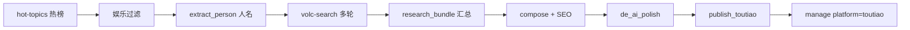

# 头条娱乐日产线 — 逻辑说明

供在 [manage.foxrouter.com](http://manage.foxrouter.com/app/deliverables?platform=toutiao) 评估成稿时对照。每篇产物 HTML 末尾含 `<!-- pipeline-meta:... -->` JSON，字段与下文一致。

## 总览



## 分步逻辑

| 步骤 | Skill / 脚本 | 输入 | 输出 | 目的 |
|------|----------------|------|------|------|
| 1 | `hot-topics` → `fetch_entertainment_hot.py` | 微博/抖音/头条 API | `hot.json` items | 当日娱乐向热搜池 |
| 2 | `entertainment_filter` | 热榜标题 | 过滤后 items | 去掉时政/宏观/灾害 |
| 3 | `extract_person.py` | 热搜标题 | `person` | 检索与 SEO 主实体 |
| 4 | `research_topic.py` + `volc-search` | person + topic | `data/searchdata/*_volc.md` | R1 广度 / R2 深度 / R3 聚焦 / R4 原话 |
| 5 | `research_bundle.py` | 各轮 items | `*_bundle.json`（≤30 facts） | 去重、抽数字/原话/来源 |
| 6 | `compose_from_research.py` | hot + research | `article.json` + HTML | 结构化正文（4–8 条 fact） |
| 7 | `seo_optimize.py` | 标题/正文/人名 | `seo_check` 打分与标题优化 | 搜一搜/头条可读性与关键词 |
| 8 | `de_ai_polish.py` | 段落文本 | 去 AI 味句式 | 更像资讯稿 |
| 9 | `publish_toutiao.py` | article.json | manage 产物 id | 指挥台预览与人工改稿 |

## 搜索轮次（默认日产 vs 演示）

| 模式 | 脚本 | 轮次 | 每轮条数 | 说明 |
|------|------|------|----------|------|
| 日产 | `pipeline_daily_toutiao_entertainment.py` | 4 | 8 | 每日 5 篇，成本可控 |
| 演示/深研 | `demo_toutiao_full_report.py` | 4 | R1=10, R2=10 | 广 10 + 深 10，bundle 最多 30 facts |

## 成稿结构（short）

1. **导语**：人名 + 热搜事件 + 热度/数字钩子  
2. **主体 h2**：含人名的信息段（4–8 条可核实 fact，带「据××报道」）  
3. **原话 h2**（有则写）  
4. **数字 box**（有则写）  
5. **互动收尾**：「你咋看」+ 免责声明  

体裁 `long` 时 fact 上限更高、字数目标 ≥1800。

## SEO 规则（`seo_optimize.py`）

| 检查项 | 规则 | 权重 |
|--------|------|------|
| 标题长度 | 12–28 字为佳 | +2 |
| 人名在标题 | 主实体出现 | +3 |
| 人名在首段 | 前 120 字内 | +2 |
| h2 含人名 | ≥1 个小标题 | +2 |
| 正文字数 | short ≥800 汉字 | +2 |
| 关键词密度 | 人名出现 3–8 次 | +1 |
| 禁用空洞词 | 少「震惊」「竟然」 | +1 |

`seo_score` 0–15，≥10 为「可发」，<10 建议在 manage 内改标题/补人名后再发。

## 指挥台评估清单

打开产物后建议看：

1. **标题**是否保留热搜信息量、人名是否正确（非「何猷君婚」截断）  
2. **正文**是否有多条独立 fact，而非只复述标题  
3. 文末 HTML 注释里的 `pipeline-meta`：`seo_check`、`facts_used`、`research_rounds`  
4. `data/searchdata/` 对应 bundle 是否够厚（深研模式）

## 入口命令

```bash
# 日产 5 篇（默认上传 manage）
python3 scripts/pipeline_daily_toutiao_entertainment.py

# 单条演示（默认 --publish，广10+深10）
python3 scripts/demo_toutiao_full_report.py

# 仅本地、不上传
python3 scripts/demo_toutiao_full_report.py --no-publish
```

## 与微信公众号线区别

| 项目 | 头条娱乐线 | 公众号 Top 线 |
|------|------------|----------------|
| 入口 | `pipeline_daily_toutiao_entertainment.py` | `pipeline_top_article.py` |
| 选题 | 国内娱乐热搜 | AttentionVC #1 + Twitter |
| 平台 | `toutiao` | `wechat` |

两条线互不覆盖，共用 `zero-deliverables` 上传。
